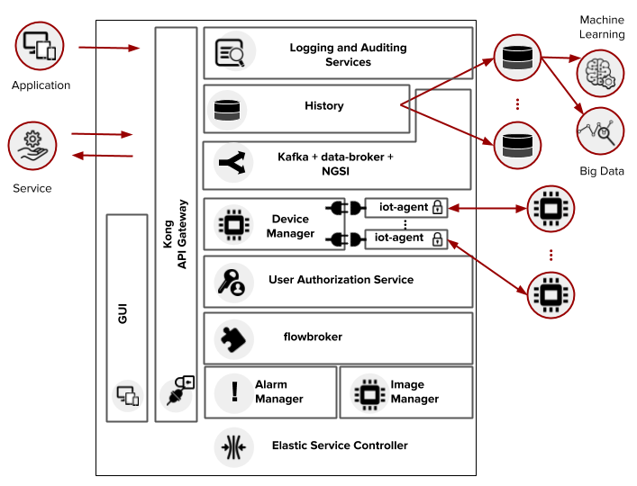

Architecture
============

This document describes the current architecture that guides the platform
implementation, detailing the components that comprise the solution, as well as
their functionalities and how each of them contribute to the platform as a
whole.

While a brief explanation of each component is provided, this high level
description does not explain (or aims to explain) the minutia of each
component's implementation. For that, please refer to each component's own
documentation.

.. contents:: Table of Contents
  :local:

Components
----------

dojot was designed to make fast solution prototyping possible, providing a
platform that's easy to use, scalable and robust. Its internal architecture
makes use of many well-known open-source components with others designed and
implemented by dojot team. This architecture is described on
:numref:`new_arch`.

.. _new_arch:

    Current Architecture

Considering this architecture the basic utilization flow is as follows: The
user configures IoT devices through the GUI or directly using the REST APIs
provided by the API Gateway, he also configures processing flows to deal with
the data generated by the configured devices. As an example we can generate
notifications when the data of a device has one of its values reaching a
threshold or we can add an entry to a database when a device enters or leaves
an specific geographic location. This user operations on the API result in
configurations across the internal services of the middleware (Broker, CEP and
iot-agent), being partially abstracted by the orchestration service.

The user contexts are isolated and there is no data sharing, the access
credentials are validated by the authorization service for each and every
operation (API Request). Once the devices and the flows are configured, the
iot-agent is capable of mapping the data received from devices, encapsulated on
MQTT for example, and send then to the context broker for internal
distribution, reaching, for instance, the history service so it can persist the
data on a database and the CEP for processing it based on rules. If certain
conditions are matched when rules are being processed, a new event is generated
and sent to the broker service to be redistributed to the interested services.

More detailed and updated information can be found on the `dojot Github
repository <https://github.com/dojot>`_.

Each one of the components that are part of the architecture are briefly
described on the sub-sections below.

Kafka + data-broker + NGSI
***********************************

Apache Kafka is a distributed messaging platform that can be used by
applications which need to stream data or consume/produce data pipelines. In
comparison with other open-source messaging solutions, Kafka seems to be more
appropriate to fulfil *dojot*'s architectural requirements (responsibility
isolation, simplicity, and so on).

In Kafka, a specialized topics structure is used to insure isolation between
different users and applications data, enabling a multi-tenant infrastructure.

The flow-broker service makes use of an in-memory database for efficiency. It
adds context to Apache Kafka, making it possible that internal or even external
services are able to subscribe or query data based on context. Flow-broker is
also a distributed service to avoid it being a single point of failure or even
a bottleneck for the architecture.

To keep a certain level of compatibility with NGSI-compatible components, we
added a NGSI interface translation service.

DeviceManager
**************

DeviceManager is a core entity which is responsible for keeping device and
templates data models. It is also responsible for publishing any updates to all
interested components (namely IoT agents, history and subscription manager)
through Kafka.

This service is stateless, having its data persisted to a database, with data
isolation for users and applications, making possible a multi-tenant
architecture for the middleware.

IoT Agent
*********

An IoT agent is an adaptation service between physical devices and *dojot* core
components. It could be understood as a *device driver* for a set of devices.
The *dojot* platform can have multiple iot-agents, each one of them being
specialized in a specific protocol like, for instance, MQTT/JSON, CoAP/LWM2M
and HTTP/JSON.

It is also responsible for all security mechanisms used in communication
channels between the devices it deals with and the component itself.

User Authorization Service
**************************

This service is responsible for managing user profiles and access control.
Basically any API call that reaches the platform via the API Gateway is
validated by this service.

To be able to deal with a high volume of authorization calls, it uses caching,
it is stateless and it is scalable horizontally. Its data is stored on a
database.

flowbroker
**********

This service provides a high level API for configuring the *dojot* with the
objective of reducing the need of knowing how to handle each one of the
services that are part of the platform. More specifically, it is responsible
for modeling different services, exposing a simplified configuration interface
and propagating this configuration to the various services when requested. It
acts as a centralized configuration manager for multiple services.

History
*******

The History component works as a pipeline for data and events that must be
persisted on a database. The data is converted into an storage structure and is
sent to the corresponding database.

For internal storage, the MongoDB non-relational database is being used, it
allows a Sharded Cluster configuration that may be required according to the
use case.

The data may also be directed to databases that are external do the *dojot*
platform, requiring only a proper configuration of Logstash and the data model
to be used.

Logging and Auditing Service
****************************

All the services that are part of the *dojot* platform generate usage metrics
of its resources and make then available to the logging and auditing service,
which process this registers and summarize then based on users and
applications.

The consolidated data is presented back to the services, allowing then, for
example, to expose this data to the user via a graphical interface, to limit
the usage of the system based on resource consumption and quotas associated
with users or even to be used by billing services to charge users for the
utilization of the platform.

Kong API Gateway
****************

The Kong API Gateways is used as the entry point for applications and external
services to reach the services that are internal to the dojot platform,
resulting in multiple advantages like, for instance, single access point and
ease when applying rules over the API calls like traffic rate limitation and
access control.

Management Application
**********************

Web Application responsible for providing responsive interfaces to manage the
*dojot* platform, including functionalities like:

* **User Profile Management**: define profiles and the API permission
  associated to those profiles
* **User Management**: Creation, Visualization, Edition and Deletion Operations
* **Applications Management**: Creation, Visualization, Edition and Deletion
  Operations
* **Device Models Management**: Creation, Visualization, Edition and Deletion
  Operations
* **Devices Management**: Creation, Visualization (real time data), Edition and
  Deletion Operations
* **Processing Flows Management**: Creation, Visualization, Edition and
  Deletion Operations

Elastic Service Controller
**************************

This is a service specialized for cloud environments, that is capable of
monitoring the utilization of the platform, being able to increase or decrease
its storage and processing capacity in an dynamic and automatic fashion to
adapt to the variability on the demand.

This controller depends that the dojot platform services are horizontally
scalable, as well as the databases must be clusterizable, which match with the
adopted architecture.

Alarm Management
****************

This component is responsible for handling alarms generated by dojot's internal
components, such as IoT agents, Device Manager, and so on.

Image manager
*************

This component is responsible for device image storage and retrievement.

Infrastructure
--------------

A few extra components are used in dojot that were not shown in
:numref:`new_arch`. They are:

- postgres: this database is used to persist data from many components, such as
  Device Manager.

- redis: in-memory database used as cache in many components, such as service
  orchestrator, subscription manager, IoT agents, and so on. It is very light
  and easy to use.

- rabbitMQ: message broker used in service orchestrator in order to implement
  action flows related that should be applied to messages received from
  components.

Communications
--------------

All components communicate with each other in two ways:

- Using HTTP requests: if one component needs to retrieve data from other one,
  say an IoT agent needs the list of currently configured devices from Device
  Manager, it can send a HTTP request to the appropriate component.

- Using Kafka messages: if one component needs to send new information about a
  resource controlled by it (such as new devices created in Device Manager),
  the component may publish this data through Kafka. Using this mechanism, any
  other component that is interested in such information needs only to listen
  to a particular topic to receive it. Note that this mechanism doesn't make
  any hard associations between components. For instance, Device Manager
  doesn't know which components need its information, and an IoT agent doesn't
  need to know which component is sending data through a particular topic.

.. _iotagent-json: https://github.com/dojot/iotagent-json
.. _iotagent-mosca: https://github.com/dojot/iotagent-mosca
.. _Mosca: https://github.com/mcollina/mosca
