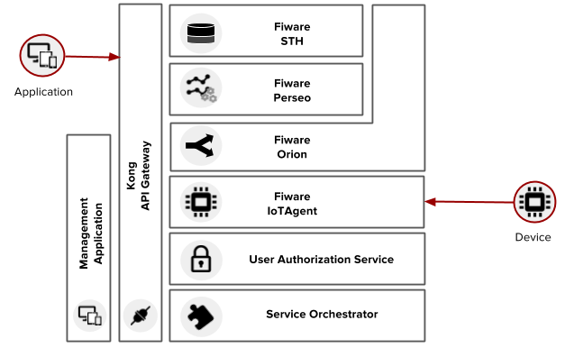

Architecture
============

This document describes the current architecture that guides the platform implementation, detailing
the components that comprise the solution, as well as their functionalities and how each of them
contribute to the platform as a whole.

While a brief explanation of each component is provided, this high level description does not
explain (or aims to explain) the minutia of each component's implementation. For that, please
refer to each component's own documentation.

.. contents:: Table of Contents
  :local:

Components
----------

This section should describe - in high level - the components that comprise the solution, giving
the reader enough detail to understand the responsabilities of the components, the technologies
involved in its design and implementation and its relation with its peers.

With the idea of utilizing open-source and consolidated components, as a starting point for the dojot IoT middleware we
adopted the european project Fiware (FIWARE, 2016). The solutions developed from this framework followed a micro-services
architecture, having as the main component a context broker that is responsible for redistributing events among services
that are part of the middleware.

The first architecture proposal took into account a basic group of Fiware services together with new services, developed
in the scope of this project, having as the main purpose, increasing the usability of the dojot platform. This initial
architecture can be seen on :numref:`old_arch`.

.. _old_arch:

    Initial Architecture

In this proposal we utilize the following components from Fiware: the Orion context broker as the communication bus for
all the internal services of the middleware, the history service, STH, for storing IoT devices data in a non-relational
MongoDB database, the Perseo CEP service that is responsible for treating events in real time and the iot-agent service
as an abstraction layer for integrating MQTT and HTTP devices.

To this services we added the Kong API Gateway to act as a centralized point-of-access removing the need of direct
communication with each one of the services, an orchestration service to abstract the middleware configuration, an
authentication service to validate user access credentials and also an user application with graphical interface with
the purpose of managing the middleware (users, devices and data flows management).

Considering this architecture the basic utilization flow is as follows: The user configures IoT devices through the
GUI or directly using the REST APIs provided by the API Gateway, he also configures processing flows to deal with the
data generated by the configured devices. As an example we can generate notifications when the data of a device has one
of its values reaching a threshold or we can add an entry to a database when a device enters or leaves an specific
geographic location. This user operations on the API result in configurations across the internal services of the
middleware (Broker, CEP and iot-agent), being partially abstracted by the orchestration service.

The user contexts are isolated and there is no data sharing, the access credentials are validated by the authorization
service for each and every operation (API Request). Once the devices and the flows are configured, the iot-agent is
capable of mapping the data received from devices, encapsulated on MQTT for example, and send then to the context broker
for internal distribution, reaching, for instance, the historic service so it can persist the data on a database and the
CEP for processing it based on rules. If certain conditions are matched when rules are being processed, a new event is
generated and sent to the broker service to be redistributed to the interested services.

This architecture made possible the validation of ideas and limitations and possible improvements were identified,
converging to a reviewed architectural proposition as described on :numref:`new_arch`.

.. _new_arch:
.. figure:: images/new_architecture.png
    :width: 100%
    :align: center
    :alt: Revised dojot Architecture

    Revised Architecture

More detailed and updated information can be found on the `dojot Github repository <https://github.com/dojot>`_.

Infrastructure
--------------

This section should describe the components that are used as ready-made pieces of working software
that compose the solution, but have no implementation specific to the project. Relevant topics that
might be discussed here are:

 * The API gateway
 * Storage components (mongo, redis, HDFS, CEPH, etc.)
 * Processing libraries and environments (Spark, Flink, Storm, kafka-streaming, map-reduce, etc.)
 * Broker components (rabbitMQ, mosquitto, kafka, verneMQ, emqtt, etc.)

Communications
--------------

This section should provide the reader with the communication strategy used to bind together the
components that comprise the solution, as well as the interfaces (protocols, serialization formats)
available to the applications and devices developers.

Deployment strategies
---------------------

This section should list the deployment requirements and implementation decisions made to satisfy
those requirements. "Why orchestrator platform 'x'?", "How can this be deployed on commercial cloud
environments?", "How can this be deployed on stand-alone environments?" are all questions that
should be answered here.

Comparative analysis
--------------------

This section should detail the features that differenciate the platform from a "stock" deployment
of fiware, as well as a feature summary comparing the proposed solution with a reduced set of
third-party implementations of IoT platforms available.
