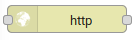
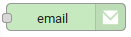
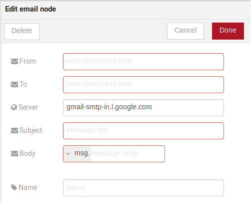

.. _Flow:

Using flow builder
==================

This tutorial will show how to properly use flow builder to process messages
and events generated by devices.

.. note::
   - Who is this for: entry-level users
   - Level: basic
   - Reading time: 10 min

Dojot nodes
-----------

.. contents::
  :local:

Device in
****

.. _device_in_node:
.. image:: images/nodes/device_node.png
    :width: 20%
    :align: left
    :alt: device_node

| This node determine an especific device to be the entry-point of a flow.
| To configure the device in node, a window like :numref:`device_in_cfg` will be
displayed.

.. _device_in_cfg:
.. figure:: images/nodes/device_node_cfg.png
    :width: 50%
    :align: center
    :alt: devicein_node_cfg

    : Device in configuration window

Fileds:

* **Name** *(optional)*: Name of the node
* **Device** *(required)*: The *dojot* device that will trigger the flow
* **Status** *(required)*: *exclude device status changes* will not use device status changes (online, offline) to trigger the flow. On the other hand, *include devices status changes* will use these status to trigger the flow.

.. note::
    If the the device that triggers a flow is removed, the flow becomes invalid.

Device template in
***********

.. _devicetemplate_in_node:
.. image:: images/nodes/devicetemplate_node.png
    :width: 20%
    :align: left
    :alt: devicetemplatein_node

This node will make that a flow get triggered by devices that are composed by a certain
template. If the device template that is configured in **device template in** node is template A, all devices 
that are composed with template A will trigger the flow. For example: *device1* is composed by templates [A,B], 
*device2* by template A and *device3* by template B. Then, in that scenario, only messages from *device1* and
*device2* will initiate the flow, because template A is one of the templates that compose those devices.

.. _devicetemplate_in_node:
.. figure:: images/nodes/devicetemplate_node_cfg.png
    :width: 50%
    :align: center
    :alt: devicetemplatein_node

    : Device template in configuration window

Fields:

* **Name** *(optional)*: Name of the node.
* **Device** *(required)*: The *dojot* device that will trigger the flow.
* **Status** *(required)*: Choose if devices status changes will trigger or not the flow.

http
****

.. _http_node:

This node sends an http request to a given address, and, then, it can forward the response to use in somewhere of the flow.

.. _http_in_node:
.. figure:: images/nodes/http_node_cfg.png
    :width: 50%
    :align: center
    :alt: httpin_node

    : Device template in configuration window

Fields:

* **Method** *(required)*: The http method (GET, POST, etc...).
* **URL** *(required)*: The URL that will receive the http request
* **Request body** *(required)*: Variable that contains the request body. This value can be assigned to the variable using the **template node**.
* **Response** *(required)*: Variable that will receive the http response.
* **Return** *(required)*: Type of the return.
* **Name** *(required)*: Name of the node.

Device out
**********

.. _deviceout_node:
.. image:: images/nodes/deviceout_node.png
    :width: 20%
    :align: left
    :alt: deviceout_node

Device out will determine wich device will have its attributes updated on *dojot* according
to the result of the flow. Bear in mind that this node doesn't send messages to your
device, it will only update the attributes on the platform. Normally, the chosen
device out is a *virtual device*, which is a device that exists only on *dojot*.
    
.. _deviceout_node_cfg:
.. figure:: images/nodes/deviceout_node_cfg.png
    :width: 50%
    :align: center
    :alt: deviceout_node_cfg

    : Device out config window

Fields:

- **Name** *(optional)*: Name of the node.
- **Device** *(required)*: Select *The device that triggered the flow* will make the device that was the entry-point
  be the end-point of the flow. *Specific device* any chosen device wil be the output of the flow and *a device 
  defined during the flow* will make a device that the flow selected during the execution the endpoint.
- **Source** *(required)*: Data structure that will be mapped as message to device out

Actuate
*******

.. _actuate_node:
.. image:: images/nodes/actuate_node.png
    :width: 20%
    :align: left
    :alt: actuate_node

Actuate node is, basically, the same thing of **device out** node. But, it can send messages
to a real device, like telling a lamp to turn the light off and etc...

.. _actuate_node_cfg:
.. figure:: images/nodes/actuate_node_cfg.png
    :width: 50%
    :align: center
    :alt: actuate_node_cfg

    : Actuate configuration

Fields:

* **Name** *(optional)*: Name of the node.
* **Device** *(required)*: A real device on dojot
* **Source** *(required)*: Data structure that will be mapped as message to device out

Change
*******

.. _change_node:
.. image:: images/nodes/change_node.png
    :width: 20%
    :align: left
    :alt: change_node

Change node is used to copy or assign values to an output, i. e., copy
values of a message attributes to a dictionary that will be assigned to
virtual device                                                                                      
                                                                                

.. _change_node_cfg:
.. figure:: images/nodes/change_node_cfg.png
    :width: 50%
    :align: center
    :alt: change_node_cfg

    : Change configuration

Fields:

* **Name** *(optional)*: Name of the node
* **msg** *(required)*: Definition of the data structure that will be sent to the next node and will
  receive the value set on the *to* field 
* **to** *(required)*: Assignment or copy of values

.. note::
    More than one rule can be assign by clicking on *+add* below the rules box.

Switch
*******

.. _switch_node:
.. image:: images/nodes/switch_node.png
    :width: 20%
    :align: left
    :alt: switch_node

The Switch node allows messages to be routed to different branches of a flow by evaluating a set of rules against each message.

.. _switch_node_cfg:
.. figure:: images/nodes/switch_node_cfg.png
    :width: 50%
    :align: center
    :alt: switch_node_cfg

    : Switch configuration

Fields:

* **Name** *(optional)*: Name of the node
* **Property** *(required)*: Variable that will be evaluated 
* **Rule box** *(required)*: Rules that will determine the outputch branch of the node.
  Also, it can be configured to stop checking rules when it finds one that matches other
  or check all the rules and route the message to the corresponding output.

.. note::
    - More than one rule can be assign by clicking on *+add* below the rules box.
    - Each condition should have an corresponding output.

Template
********

.. note::
    Despite the name, this node has nothing to do with dojot templates

.. _template_node:
.. image:: images/nodes/template_node.png
    :width: 20%
    :align: left
    :alt: template_node

This node will assign a value to a target variable. This value can be a constant,
the value of an attribute that came from the entry device and etc...

It uses the `mustache`_ template language.
Check :numref:`template_node_cfg` as example:
the field **a** of payload will be replaced with the value of the **payload.b**

.. _template_node_cfg:
.. figure:: images/nodes/template_node_cfg.png
    :width: 50%
    :align: center
    :alt: template_node_cfg

Fields:

* **Name** *(optional)*: Name of the node
* **Set Property** *(required)*: Variable that will receive the value
* **Format** *(required)*: Format template will be writen
* **Template** *(required)*: Value that will be assigned to the target variable set on **Set property**
* **Output as** *(required)*: The format of the output

Email
*****

.. _email_node:

Sends an e-mail for a given address.

.. _email_node_cfg:

Fields:

* **From** *(required)*: The source email.
* **To** *(required)*: Destination email.
* **Server** *(required)*: The server of the email destination.
* **Subject** *(required)*: Subject of the email.
* **Body** *(required)*: Message on the email. The message can be writen in a variable using the **template node**.
* **Name** *(optional)*: Name of the node.

Geofence
********

.. _geofence_node:
.. image:: images/nodes/geofence_node.png
    :width: 20%
    :align: left
    :alt: geofence_node

Select an interest area to determine wich devices will actuate the flow

.. _geofence_node_cfg:
.. figure:: images/nodes/geofence_node_cfg.png
    :width: 50%
    :align: center
    :alt: geofence_node_cfg

Fields:

* **Area** *(required)*: Area that will be selected. It can be selected with an square or with a pentagon.
* **Filter** *(required)*: Select wich side of the area will be selected: inside or outside the area demercated in the field above.
* **Name** *(optional)*: Name of the node

.. _mustache: https://mustache.github.io/mustache.5.html