Using flow builder
==================

This tutorial will show how to properly use flow builder to process messages
and events generated by devices.

.. note::
   - Who is this for: entry-level users
   - Level: basic
   - Reading time: 20 min

.. contents:: Table of Contents
  :local:
  :depth: 1

Dojot nodes
-----------

.. contents::
  :local:

Device Event in
***************

.. _event-device-in:

This node specifies that messages received from or sent to a particular device.
The message created by this node is somewhat different than the one created by
DeviceIn node:

.. code-block:: json

    {
        "data": {
            "attrs": {
                "temperature": 10,
                "some-static-attr": "efac"
            }
        }
    }

This structure can be referenced in nodes like `Template`_ such as:

.. code-block:: handlebars

    Sample message {{payload.data.attrs.temperature}}

To configure the device in node, a window like :numref:`event-device-in-panel`
will be displayed.

.. _event-device-in-panel:
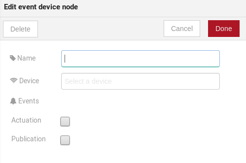

    : Device in configuration window

Fields:

* **Name** *(optional)*: Name of the node
* **Device** *(required)*: The *dojot* device that will trigger the flow
* **Events** *(required)*: Select which events will trigger this flow. The
  `Actuation` option will select actuation messages (those sent to the device)
  and `Publication` will select all messages published by the device.

.. note::
    If the the device that triggers a flow is removed, the flow won't work
    anymore.

Device template event in
************************

.. _event-template-in:

This node will specifies that messages from devices composed by a particular
template will trigger this flow. For instance, if the device template set in
this node is template A, all devices that are composed with template A will
trigger the flow. For example: *device1* is composed by templates [A,B],
*device2* by template A and *device3* by template B. Then, in that scenario,
only messages from *device1* and *device2* will initiate the flow, because
template A is one of the templates that compose those devices.

.. _event-template-in-panel:
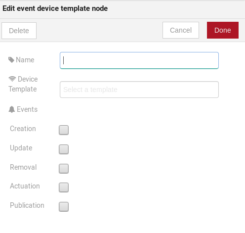

    : Device template in configuration window

Fields:

* **Name** *(optional)*: Name of the node.
* **Device** *(required)*: The *dojot* device that will trigger the flow.
* **Events** *(required)*: Select which event will trigger this flow.
  `Creation`, `Update`, `Removal` are related to device management operations.
  `Actuation` will trigger this flow in case of sending actuation messages to
  the device and `Publication` will trigger this flow whenever a device
  publishes a message to dojot.

Multi device out
****************

.. _multi-device-out:
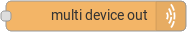

Device out will determine which device (or devices) will have its attributes
updated on *dojot* according to the result of the flow. Bear in mind that this
node doesn't send messages to your device, it will only update the attributes
on the platform. Normally, the chosen device out is a *virtual device*, which
is a device that exists only on *dojot*.

.. _multi-device-out-panel:
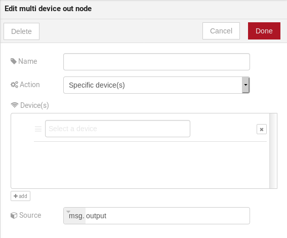

    : Device out config window

Fields:

* **Name** *(optional)*: Name of the node.
* **Action** *(required)*: Which device will receive the update. Options are:
   - `The device that triggered the flow`: this will update the same device
     that sent the message which triggered this flow.
   - `Specific device(s)`: which device(s) that will receive the update.
   - `Device(s) defined during the flow`: which device(s) that will receive the
     update. This is referenced by a list of values, just as with output
     values (msg.list_of_devices).
* **Device** *(required)*: Select "The device that triggered the flow" will
  make the device that was the entry-point be the end-point of the flow.
  "Specific device" any chosen device wil be the output of the flow and "a
  device defined during the flow" will make a device that the flow selected
  during the execution the endpoint.
* **Source** *(required)*: Data structure that will be mapped as message to
  device out

Multi actuate
*************

.. _multi-actuate:
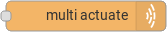

Actuate node is, basically, the same thing of **device out** node. But, it can
send messages to a real device, like telling a lamp to turn the light off and
etc.

.. _multi-actuate-panel:
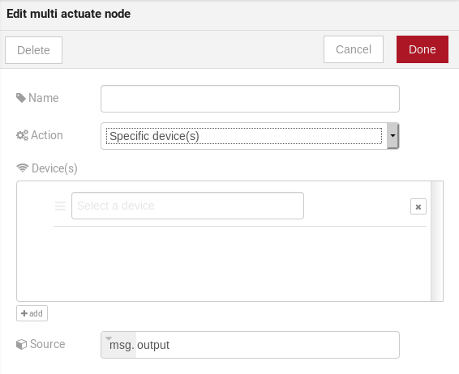

    : Actuate configuration

Fields:

* **Name** *(optional)*: Name of the node.
* **Action** *(required)*: which device a message will be sent to. Options are:
   - `The device that triggered the flow`: this will send a message to
     the same device that sent the message which triggered this flow.
   - `Specific device(s)`: which device(s) the message will be sent to.
   - `Device(s) defined during the flow`: which device(s) the message will be
     sent to. This is referenced by a list of values, just as with output
     values (msg.list_of_devices).
* **Device** *(required)*: Select "The device that triggered the flow" will
  make the device that was the entry-point be the end-point of the flow.
  "Specific device" any chosen device wil be the output of the flow and "a
  device defined during the flow" will make a device that the flow selected
  during the execution the endpoint.
* **Source** *(required)*: Data structure that will be mapped as message to
  device out

HTTP request
************

.. _http_node:
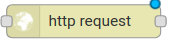

This node sends an http request to a given address, and, then, it can forward
the response to the next node in the flow.

.. _http_in_node:
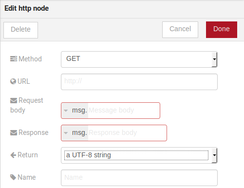

    : Http Request configuration

Fields:

* **Method** *(required)*: The http method (GET, POST, etc...).
* **URL** *(required)*: The URL that will receive the http request
* **Request body** *(required)*: Variable that contains the request body. This
  value can be assigned to the variable using the **template node**, for
  example.
* **Response** *(required)*: Variable that will receive the http response.
* **Return** *(required)*: Type of the return.
* **Name** *(optional)*: Name of the node.

Ftp request
***********

.. _ftp-request:

This node sends a file to a FTP server. When uploading a
file, its name can be set by the "Filename" field in the same way as
other output variables (it should refer to a variable set in the flow).
The file encoding can also be set to, for example, "base64" or "utf-8".

.. _ftp-request-panel:
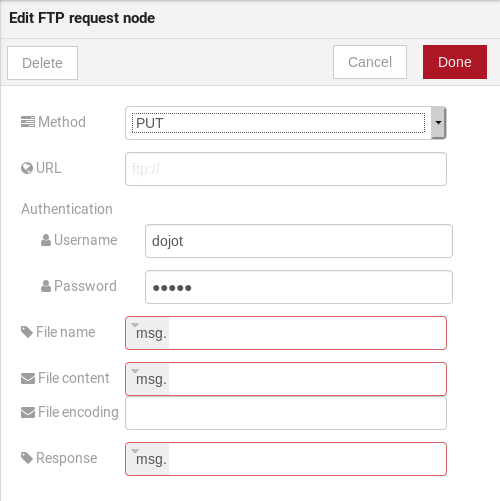

    : Device template in configuration window

Fields:

* **Method** *(required)*: The FTP action to be taken (PUT).
* **URL** *(required)*: the FTP server
* **Authentication** *(required)*: Username and password to access this server.
* **File name** *(required)*: Variable containing the file name to be uploaded.
* **File content** *(required)*: This variable should hold the file content.
* **File encoding** *(required)*: How the file is encoded
* **Response** *(optinal)*: Variable that will receive the FTP response
* **Name** *(optional)*: Name of the node.

Notification
************

.. _notification-request:

This node sends a user notification to other services in dojot. This might be
useful to generate application notifications that could be consumed by a
front-end application. The user can set a static message to be sent or, as
other output nodes, configure a variable set in a previous node which will be
resolved at runtime. Also, metadata can be added to the message: it can be
a simple key-value object containing arbitrary data.

.. _notification-panel:
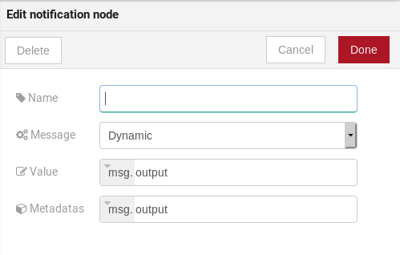

    : Device template in configuration window

Fields:

* **Name** *(optional)*: Name of the node
* **Message** *(required)*: Static, if the notification should contain a static
  text, or dynamic, which will enable a variable to be set as output to this
  node. This variable will be substituted in runtime.
* **Value** *(required)*: message content (either static text or a variable
  reference).
* **Metadata** *(required)*: variable reference containing a simple dictionary
  (key-value pairs) containing the metadata to be added to the message

Change
******

.. _change_node:
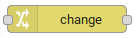

Change node is used to copy or assign values to an output, i. e., copy
values of a message attributes to a dictionary that will be assigned to
virtual device.

.. _change_node_cfg:
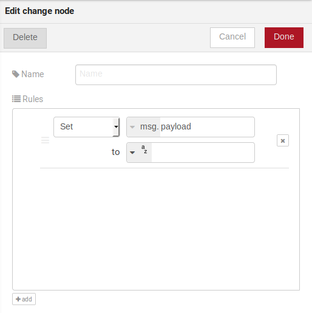

    : Change configuration

Fields:

* **Name** *(optional)*: Name of the node
* **msg** *(required)*: Definition of the data structure that will be sent to
  the next node and will receive the value set on the *to* field
* **to** *(required)*: Assignment or copy of values

.. note::
    More than one rule can be assign by clicking on *+add* below the rules box.

Switch
*******

.. _switch_node:
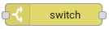

The Switch node allows messages to be routed to different branches of a flow by
evaluating a set of rules against each message.

.. _switch_node_cfg:
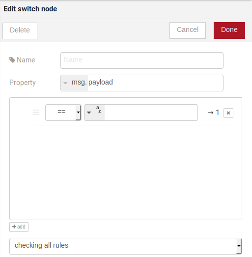

    : Switch configuration

Fields:

* **Name** *(optional)*: Name of the node
* **Property** *(required)*: Variable that will be evaluated
* **Rule box** *(required)*: Rules that will determine the output branch of the
  node. Also, it can be configured to stop checking rules when it finds one
  that matches other or check all the rules and route the message to the
  corresponding output.

.. note::
    - More than one rule can be assign by clicking on *+add* below the rules box.
    - The rules are mapped one-to-one to the output conectors. Then the first rule is related
      to the first output, the second rule to the second output and etc...

Template
********

.. note::
    Despite the name, this node has nothing to do with dojot templates

.. _template_node:
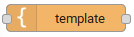

This node will assign a value to a target variable. This value can be a
constant, the value of an attribute that came from the entry device and etc...

It uses the `mustache`_ template language.
Check :numref:`template_node_cfg` as example:
the field **a** of payload will be replaced with the value of the **payload.b**

.. _template_node_cfg:
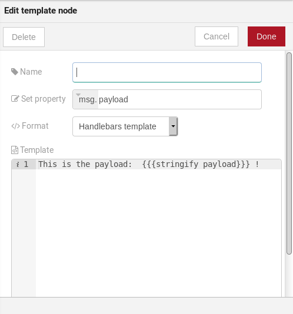

    : Template configuration

Fields:

* **Name** *(optional)*: Name of the node
* **Set Property** *(required)*: Variable that will receive the value
* **Format** *(required)*: Format template will be writen
* **Template** *(required)*: Value that will be assigned to the target variable
  set on **Set property**
* **Output as** *(required)*: The format of the output

Cron
****

.. _cron_node:
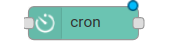

Processing node to create/remove cron jobs.
Cron allowing to schedule tasks to: send events to the data broker or execute a http request.

.. _cron_node_cfg:
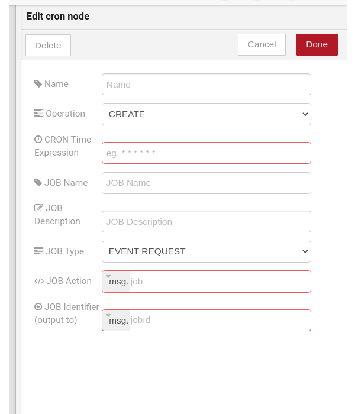

    : Cron configuration

Fields:

* **Operation** *(required)*: Defines the type of processing if creating or removing cron jobs (CREATE, REMOVE).
* **CRON Time Expression** *(required)*: CRON Time Expression, eg. `* * * * * *`. Required when using CREATE type operation.
* **JOB Name** *(optional)*: Name of Job.
* **JOB Description** *(optional)*: Description of Job.
* **JOB Type** *(required)*: Options are EVENT REQUEST or HTTP REQUEST.
* **JOB Action** *(required)*:  Variable that contains the JSON to JOB Action. This value can be assigned to the variable using the template node, for example.
* **JOB Identifier (output to)** *(required)*: Variable that will receive the JOB Identifier.
* **Name** *(optional)*: Name of the node

Example of `JOB Action` when `JOB Type` is **HTTP REQUEST**:

.. code-block:: json

    {
        "method": "PUT",
        "headers": {
                      "Authorization": "Bearer ${JWT}",
                      "Content-Type": "application/json"
                    },
        "url": "http://device-manager:5000/device/${DEVICE_ID}/actuate",
        "body": {
                    "attrs": {"message": "keepalive"}
                }
    }

Example of `JOB Action` when `JOB Type` is **EVENT REQUEST**:

.. code-block:: json

    {
        "subject": "dojot.device-manager.device",
        "message": {
                      "event": "configure",
                      "data": { "attrs": { "message": "keepalive"},
                                "id": "6a1213"
                               },
                      "meta": { "service": "admin"}
                    }
    }

Cron batch
**********

.. _cron_batch_node:

It works like the `cron node`, but here you can use a batch of schedules.

.. _cron_batch_node_cfg:
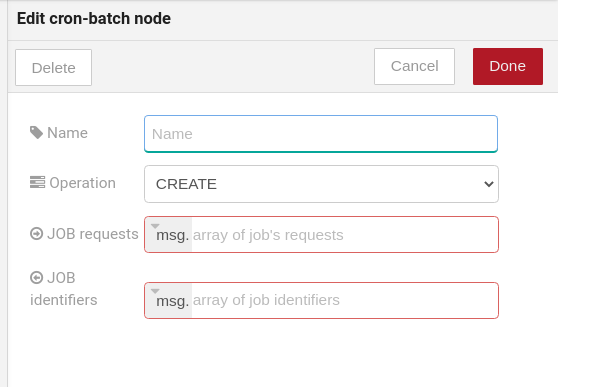

    : Cron batch configuration

Fields:

* **Operation** *(required)*: Defines the types of processings if creating or removing cron jobs (CREATE, REMOVE).
* **JOB requests** *(required)*:  Variable that contains the array of JSONs to JOB Actions.
* **JOB identifiers** *(required)*: Variable that will receive the array of job identifiers.
* **Name** *(optional)*: Name of the node

Geofence
********

.. _geofence_node:
.. image:: images/nodes/geofence_node.png
    :width: 20%
    :align: left
    :alt: geofence_node

Select an interest area to determine which devices will activate the flow

.. _geofence_node_cfg:
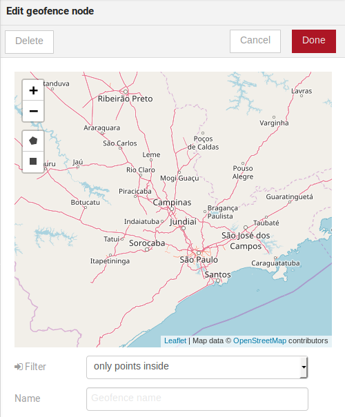

    : Geofence configuration

Fields:

* **Area** *(required)*: Area that will be selected. It can be chosen with an
  square or with a pentagon.
* **Filter** *(required)*: Which side of the area will be picked: inside or
  outside the marked area in the field above.
* **Name** *(optional)*: Name of the node

Get Context
***********

.. _getcontext_node:
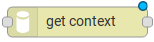

This node is used to get a variable that is in the context and assign its value
to a variable that will be used in the flow.

Note: Context is a mechanism that allows a given set of data to persist
beyond the life of the event, thus making it possible to store a state for the
elements of the solution.

.. _getcontext_node_cfg:
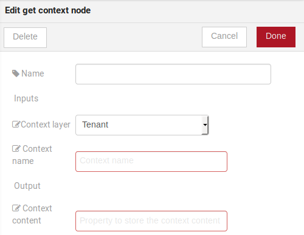

Fields:

* **Name** *(optional)**: Name of the node
* **Context layer** *(required)**: The layer of the context that que variable
  is at
* **Context name** *(required)**: The variable that is in the context
* **Context content** *(required)**: The variable in the flow that will receive
  the value of the context

Merge data
***********

.. _merge_data_node:
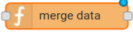

This node allows objects to be merged in the **flow** context.

.. _merge_data_node_cfg:
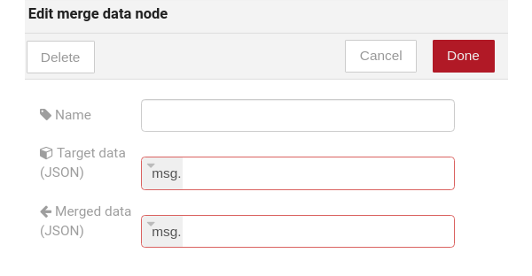

    : Merge data configuration

Fields:

* **Target data (JSON)** *(required)*: Variable that contains the data to be merged.
* **Merged data (JSON)** *(required)*: Variable that will receive the new data merged with your existing data.
* **Name** *(optional)*: Name of the node

Cumulative sum
**************

.. _cumulative_sum_node:
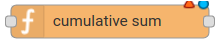

The cumulative sum node accumulates the data for an attribute in a temporal window and keeping this in the **flow** context.

.. _cumulative_sum_node_cfg:
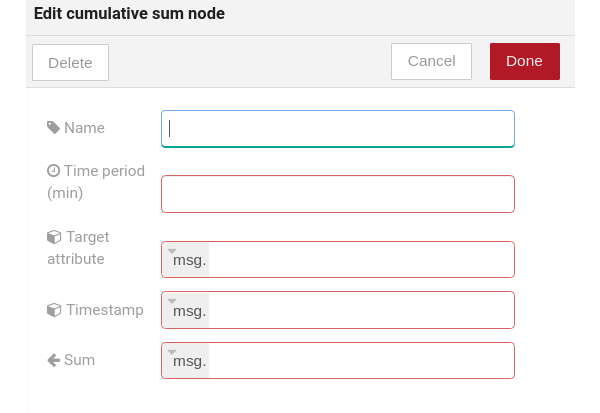

    : Cumulative sum configuration

Fields:

* **Time period (min)** *(required)*: Time in minutes to keep the sum.
* **Target attribute** *(required)*: Variable that contains the value to be sum.
* **Timestamp** *(required)*:  Variable containing the timestamp from the device or dojot. Most of the time it can be set with `payload.metadata.timestamp`.
* **Sum** *(required)*:  Variable that will receive the sum.
* **Name** *(optional)*: Name of the node

Publish in FTP topic
********************

.. _kafka2ftp_node:
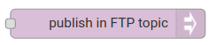

Node to forward messages to Apache Kafka FTP topic.

It publishes to the ``tenant.dojot.ftp`` topic (*tenant* is defined by which tenant the flow belongs to)
in which the messages are produced with informations about the file name,
encoding format and file content.

.. _kafka2ftp_node_cfg:
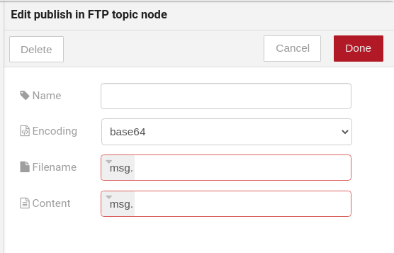

    : *Publish in FTP topic* configuration

Fields:

* **Encoding** *(required)*: The encoding that the file to be sent uses. Valid values are: ascii, base64, hex, utf16le, utf8 and binary.
* **Filename** *(required)*: Variable with the name of the file to be sent.
* **Content** *(required)*: Variable with the file contents to be sent.
* **Name** *(optional)*: Name of the node

Example of a message sent by this node:

.. code-block:: json

    {
        "metadata": {
            "msgId": "33846252-659f-42cc-8831-e2ccb923a702",
            "ts": 1571858674,
            "service": "flowbroker",
            "contentType": "application/vnd.dojot.ftp+json"
        },
        "data": {
            "filename": "filename.jpg",
            "encoding": "base64",
            "content": "..."
        }
    }

Where the keys above are:

* msgId:  Value of type uuidv4 used to uniquely identify the message in dojot's context.
* ts: Timestamp in Unix Timestamp (ms) format from the moment the message was produced.
* service: Name of the service that generated the message.
* contentType: Type of encoding used by the file.
* filename: Name of the file to be sent to the FTP server.
* encoding: Encoding the contents of the file. Valid values are: ascii, base64, hex, utf16le, utf8 and binary.
* content: File contents.

This can be used with the kafka2ftp component. See more in :doc:`components-and-apis`.

Deprecated nodes
****************

These nodes are scheduled to be removed in future versions. They will work
with no problems with current flows.

Device in
+++++++++

.. _device_in_node:
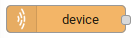

This node determine an especific device to be the entry-point of a flow. To
configure the device in node, a window like :numref:`device_in_cfg` will be
displayed.

.. _device_in_cfg:
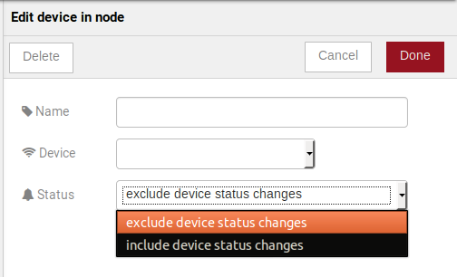

    : Device in configuration window

Fields:

* **Name** *(optional)*: Name of the node
* **Device** *(required)*: The *dojot* device that will trigger the flow
* **Status** *(required)*: *exclude device status changes* will not use device
  status changes (online, offline) to trigger the flow. On the other hand,
  *include devices status changes* will use these status to trigger the flow.

.. note::
    If the the device that triggers a flow is removed, the flow becomes invalid.

Device template in
++++++++++++++++++

.. _devicetemplate_in_node:
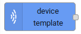

This node will make that a flow get triggered by devices that are composed by a
certain template. If the device template that is configured in **device
template in** node is template A, all devices that are composed with template A
will trigger the flow. For example: *device1* is composed by templates [A,B],
*device2* by template A and *device3* by template B. Then, in that scenario,
only messages from *device1* and *device2* will initiate the flow, because
template A is one of the templates that compose those devices.

.. _devicetemplate_node_cfg:
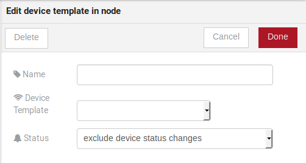

    : Device template in configuration window

Fields:

* **Name** *(optional)*: Name of the node.
* **Device** *(required)*: The *dojot* device that will trigger the flow.
* **Status** *(required)*: Choose if devices status changes will trigger or not
  the flow.

Device out
++++++++++

.. _deviceout_node:
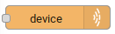

Device out will determine which device will have its attributes updated on
*dojot* according to the result of the flow. Bear in mind that this node
doesn't send messages to your device, it will only update the attributes on the
platform. Normally, the chosen device out is a *virtual device*, which is a
device that exists only on *dojot*.

.. _deviceout_node_cfg:
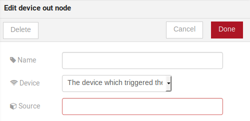

    : Device out config window

Fields:

* **Name** *(optional)*: Name of the node.
* **Device** *(required)*: Select "The device that triggered the flow" will
  make the device that was the entry-point be the end-point of the flow.
  "Specific device" any chosen device wil be the output of the flow and "a
  device defined during the flow" will make a device that the flow selected
  during the execution the endpoint.
* **Source** *(required)*: Data structure that will be mapped as message to
  device out

Actuate
+++++++

.. _actuate_node:
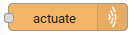

Actuate node is, basically, the same thing of **device out** node. But, it can
send messages to a real device, like telling a lamp to turn the light off and
etc.

.. _actuate_node_cfg:
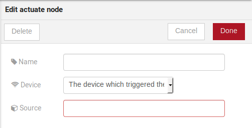

    : Actuate configuration

Fields:

* **Name** *(optional)*: Name of the node.
* **Device** *(required)*: A real device on dojot
* **Source** *(required)*: Data structure that will be mapped as message to
  device out

Learn by examples
-----------------

.. contents::
  :local:

Using http node
***************

Imagine this scenario: a device sends an *username* and a *password*, and from
these attrs, the flow will request to a server an authentication token that
will be sent to a virtual device that has a *token* attribute.

.. _using_http_node_flow:
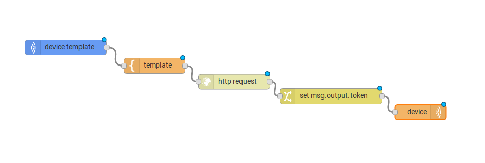

    : Flow used to explain http node

To send that request to the server, the http method should be a POST and the
parameters should be within the requisition. So, in the template node, a JSON
object will be assigned to a variable. The body (parameters *username* and
*password*) of the requisition will be assigned to the **payload** key of the
JSON object. And, if needed, this object can have a *headers* key as well.

.. _using_http_node_template:
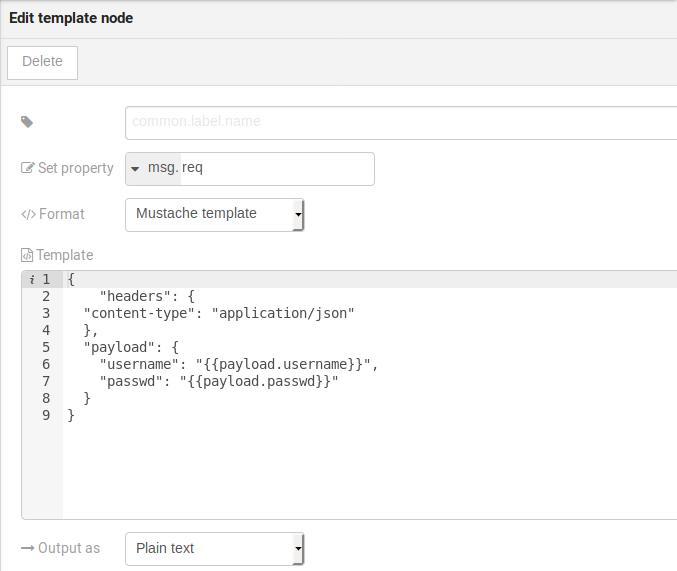

    : Template node configuration

Then, on the http node, the Requisition field will receive the value of the
object created at the template node. And, the response will be assigned to any
variable, in this case, this is *msg.res* .

.. note::
    If UTF-8 String buffer is chosen in the return field, the body of the
    response body will be a string. If JSON object is chosen, the body will be
    an object.

.. _using_http_node_http:
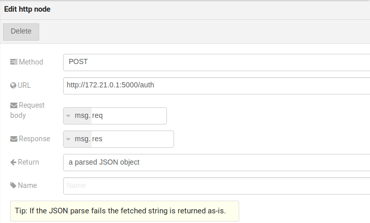

    : Template node configuration

As seen, the response of the server is *req.res* and the response body can be
accessed on **msg.res.payload**. So, the keys of the object that came on the
responsy can be accessed by: **msg.res.payload.key**. On figure
:numref:`using_http_node_change` the token that came in the response is
assigned to the attribute token of the virtual device.

.. _using_http_node_change:
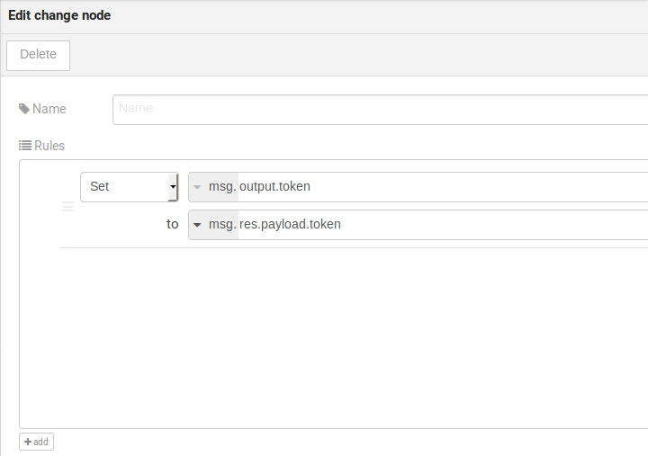

    : Template node configuration

.. _using_http_node_deviceout:
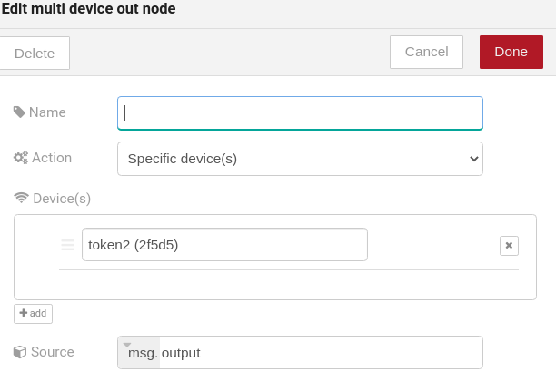

    : Device out configuration

Then, the result of the flow is the attribute *token* of the virtual device be
updated with the token that came in the response of the http request:

.. _using_http_node_result:
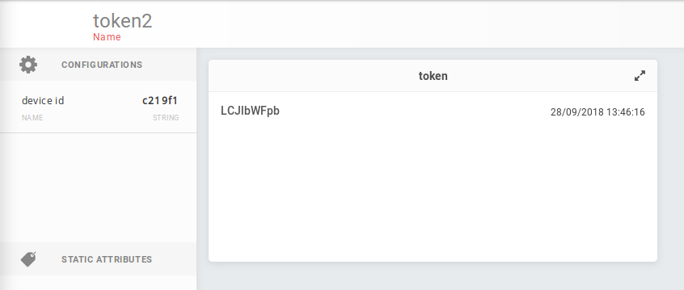

    : Device updated

Using geofence node
*******************

A good example to learn how geofence node works ia studying the flow below:

.. _using_geofence_node_flow:
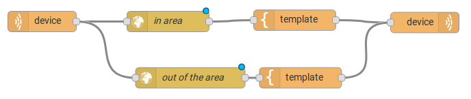

    : Flow using geofence

The geofence node named *in area* is set like seem in
:numref:`using_geofence_node_geofence`. The only thing that diffs the geofence
nodes *in area* from *out of the area* is the field **Filter** that, in the
first, is configured to *only points inside* and *only points outside* in the
second, respectively.

.. _using_geofence_node_geofence:
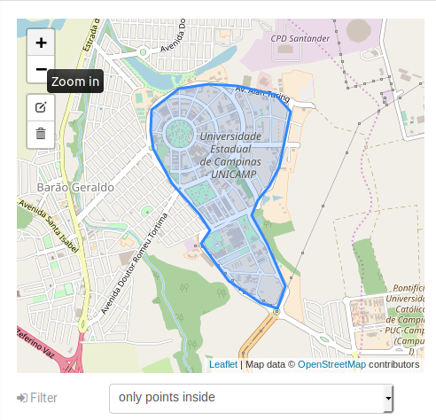

    : Geofence node configuration

Then, if the device that is set as *device in* sends a messagem with a geo
attribute the geofence node will evaluate the geo point acoording to its rule
and if it matches the rule, the node forward the information to the next node
and, if not, the execution of the branch, which has the geofence that the rule
didn't match, stops.

.. note::
    To geofence node work, the messege received **should** have a geo attribute, if not, the branches of the flow will stop
    at the geofence nodes.

Back to the example, if the car sends a message that he is in the marked area,
like ``{ "position": "-22.820156,-47.2682535" }``, the message received in
device out will be "Car is inside the marked area", and, if it sends
``{"position": "0,0"}`` device out will receive "Car is out of the marked area"

.. _using_geofence_node_template:
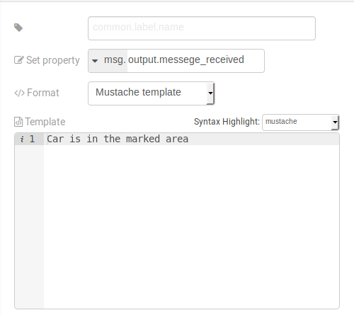

    : Template node configuration if the car is in the marked area

.. _using_geofence_node_result:
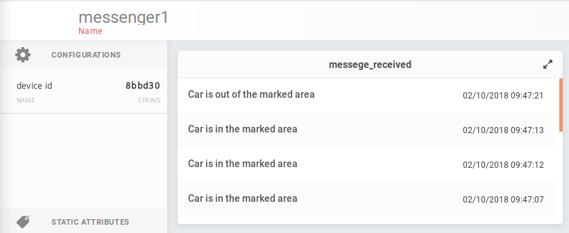

    : Output in device out

Using cumulative sum, switch and notification node
**************************************************

Imagine this scenario: a device sends the level of rain, we want to generate a notification if the accumulated, sum, of the rains in the last hour is greater than 100.

.. _using_cum_sum_noti_flow:
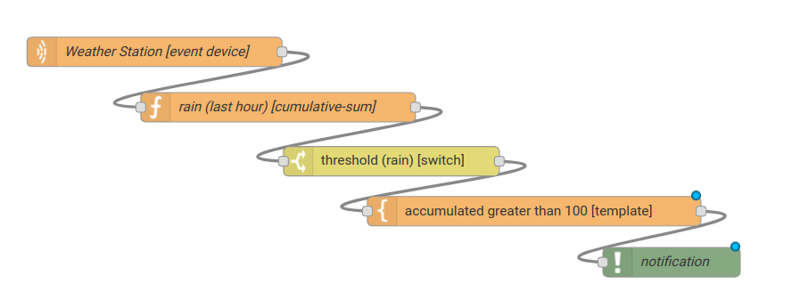

    : Flow using cumulative sum, switch and notification

In the `cumulative sum` node, we will accumulate the value of rain (*Target attribute*) in the
60 minute time window (*Time period*) and we will set this sum in a new attribute
called `payload.data. attrs.rain60Min` (*Sum*). The *Timestamp* setting refers to the
timestamp from the device or dojot, most of the time it can be set with
`payload.metadata.timestamp`. See more in :numref:`using_cum_sum_node_cumulative` .

.. _using_cum_sum_node_cumulative:
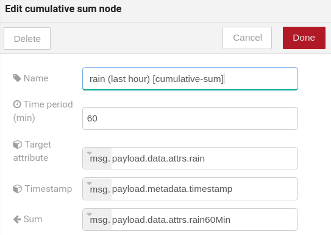

    : Cumulative sum node configuration

We want the notification to be triggered only if the accumulated rain value is greater than 100, for that we will use the switch node. As in image :numref:`using_cum_sum_node_switch`.

.. _using_cum_sum_node_switch:
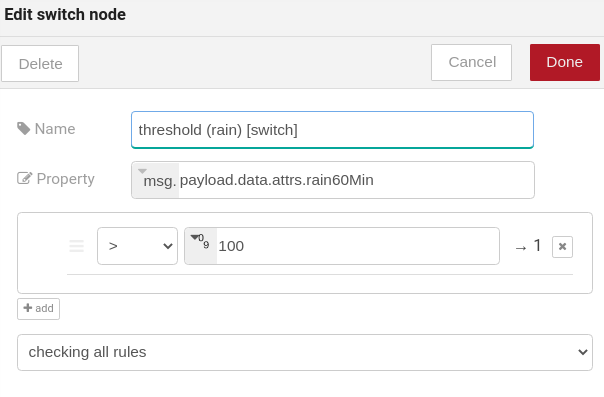

    : Switch node configuration

Now, if our value is greater than 100 we need to generate the notification,
for that we will use an auxiliary node before, the *template* node.
In the template node we will create the message that will appear in the notification
and define its metadata,  :numref:`using_cum_sum_node_template`.

.. _using_cum_sum_node_template:
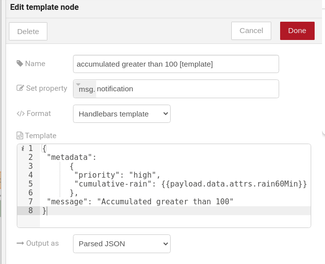

    : Template node configuration

Finally, we will configure the notification node, as in image :numref:`using_cum_sum_node_noti`.

.. _using_cum_sum_node_noti:

    : Notification node configuration

So, if the weather station (device set in the event device
node with publication checked)
sends several messages like `{" rain ": 5}`
during the last hour and one of these times the sum exceeds 100,
the notification will be generated. Note: Multiple notifications
can be generated, as long as the accumulated value is greater than 100.
See image :numref:`using_cum_sum_result`.

.. _using_cum_sum_result:
.. figure:: images/nodes/using_cum_sum_result.png
    :width: 80%
    :align: center
    :alt: using_cum_sum_result

    : Notification

.. _mustache: https://mustache.github.io/mustache.5.html
