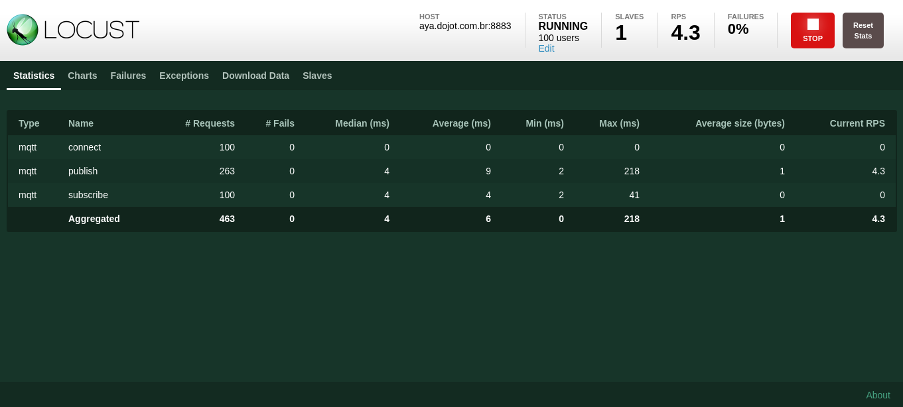

Load testing Dojot platform
===========================

In this tutorial, will be shown how to run a load test using the dojot's Locust implementation.

.. ATTENTION::
  Locust was created to work with VerneMQ. Tests with Mosca are not guaranteed to work.

.. contents:: Table of Contents
  :local:

Setting the environment up
--------------------------

First of all, you will need a running dojot environment. Check the :doc:`./installation-guide` for
more info.

To access the Locust implementation, download the dojot repository on your machine and switch to 
the same version as your current environment:

.. code:: shell

  git clone https://github.com/dojot/dojot.git
  cd dojot
  git checkout v0.5.1

Enter in Locust directory:

.. code:: shell

  cd connector/mqtt/locust

Running a simple test
---------------------

In this section, it will be shown how to configure and run Locust, and also how to generate 
certificates with the ``generate_certs`` script in order to execute the load test. This is a simple 
test where will be created 100 clients to send messages to dojot.

Configuration
^^^^^^^^^^^^^

.. NOTE::
  Make sure to check the README included in Locust directory to learn more about the architecture
  and configurations. In this tutorial we will only cover the most important configurations.

Before running the tests, there must be changed some configurations in Locust docker compose files.

Open ``Docker/docker-compose-master.yml`` and change the following environment variables:

.. code:: yaml

  # The location of your dojot installation
  DOJOT_URL: "http://1.2.3.4"
  # Usually it's the dojot address too (if you don't know for sure, keep the same address as dojot)
  DOJOT_MQTT_HOST: "1.2.3.4"
  # The default MQTTS port
  DOJOT_MQTT_PORT: "8883"

Open ``Docker/docker-compose-slave.yml`` and change the following environment variables:

.. code:: yaml

  # The location of your dojot installation
  DOJOT_URL: "http://1.2.3.4"
  # Usually it's the dojot address too (if you don't know for sure, keep the same address as dojot)
  DOJOT_MQTT_HOST: "1.2.3.4"
  # The default MQTTS port
  DOJOT_MQTT_PORT: "8883"

.. NOTE::
  We are assuming you are running the master and the slave in the same machine, i.e. in
  *non-distributed mode*. Later on will be shown how to distribute slaves between multiple machines.

Open ``Docker/scripts/generate_certs/docker-compose.yml`` and change the following environment
variables:

.. code:: yaml

  # The location of your dojot installation
  DOJOT_URL: "http://1.2.3.4"

Generating the certificates
^^^^^^^^^^^^^^^^^^^^^^^^^^^

As said before, the communication from Locust to dojot is secure, then, it is necessary to use certificates.

There are two ways of simulating devices: you can create fake devices (will not show up in
dojot's GUI) or real devices. In this part of the tutorial, we will create real devices, so you can
check the sent messages in the GUI.

Before running the script, we need to initialize the Locust master. Inside Locust repository, run:

.. code:: shell

  docker-compose -f Docker/docker-compose-master.yml up

After its initialization, run the ``generate_certs`` script docker compose and enter in it:

.. code:: shell

  docker-compose -f Docker/scripts/generate_certs/docker-compose.yml up -d
  docker-compose -f Docker/scripts/generate_certs/docker-compose.yml exec generate-certs bash

Create the devices in dojot:

.. code:: shell

  generate_certs dojot create --devices 100

You can now check that the devices are created in dojot.

  : Some of the devices that ``generate_certs`` created in dojot.

  : The template used by ``generate_certs`` to create devices.

Generate the certificates for them:

.. code:: shell

  generate_certs cert --dojot

The certificates are exported to the ``cert`` directory. Now the test can be initialized!

Initializing the slaves
^^^^^^^^^^^^^^^^^^^^^^^

Locust master does nothing by itself. The one who does all the work of sending requests is the
Locust slave container. Initialize it by running:

.. code:: shell

  docker-compose -f Docker/docker-compose-slave.yml up

You should see a message in the Locust master log saying that one slave has connected to him.

Running the test
^^^^^^^^^^^^^^^^

You are all set to begin the test. To run it, you need to access the Locust interface in your
browser in ``localhost:8089`` (supposing you are running Locust master in ``localhost``).

Type ``100`` in ``Number of users to simulate``, ``10`` in ``Hatch rate`` and click in
``Start swarming``. This tells Locust to run 100 clients, creating 10 of them per second.

  : Configuring Locust to run the clients.

The default configuration is for every client to send a message each 30 seconds, so you'll have to
wait a moment for the messages to arrive at dojot.

  : Locust statistics after running for a few minutes.

You can go to dojot and see that the messages are arriving there.

  : An example device receiving messages.

Running a distributed test
--------------------------

For small tests, the forementioned procedure might be sufficient, but if you really want to force
dojot, you might encounter some barriers when using only one slave and/or one machine. As a solution
for this problem, Locust has a **distributed mode**, permitting you to initialize multiple slaves in
multiple machines, limiting Locust performance to the amount of processing power (and budget!) you
got.

We are going to use two virtual machines to run 4 slaves (2 in each VM) and 1 master (in one of
them) to create 1,000 fake devices. We will refer to the machine with the master as **primary** and
the other as **secondary**.

.. ATTENTION::
  There is no correlation between the chosen numbers: the amount of clients that each slave supports
  depends on various variables, such as the number of available CPU cores.

.. TIP::
  We advice you to run 1 slave per CPU core you have in the machine, i.e. if you have a VM with 4
  CPUs, run 4 slaves.

Configuration for the distributed case
^^^^^^^^^^^^^^^^^^^^^^^^^^^^^^^^^^^^^^

Before running the tests, there must be changes to be made in some Locust docker compose files. Note
that you must clone the dojot repository in each machine that you will use for Locust.

.. TIP::
  Since the configurations can be the same for the slaves and the generate_certs script, you can
  share them between machines by using ``sshfs``. Assuming you are in the Locust directory in the
  secondary machine, run the following command:

  .. code:: shell

    sshfs -o allow_other -o nonempty <user>@<ip>:/path/to/dojot/connector/mqtt/locust/Docker Docker

  Check the `sshfs`_ documentation for more details.

Open ``Docker/docker-compose-master.yml`` in the primary machine and change the following
environment variables:

.. code:: yaml

  # The location of your dojot installation
  DOJOT_URL: "http://1.2.3.4"
  # Usually it's the dojot address too (if you don't know for sure, keep the same address as dojot)
  DOJOT_MQTT_HOST: "1.2.3.4"
  # The default MQTTS port
  DOJOT_MQTT_PORT: "8883"

Open ``Docker/docker-compose-slave.yml`` and change the following environment variables:

.. code:: yaml

  # The location of your dojot installation
  DOJOT_URL: "http://1.2.3.4"
  # Usually it's the dojot address too (if you don't know for sure, keep the same address as dojot)
  DOJOT_MQTT_HOST: "1.2.3.4"
  # The default MQTTS port
  DOJOT_MQTT_PORT: "8883"

  # If it's in the same machine as the master, you can leave as it is
  LOCUST_MASTER_HOST: "locust-master"

  # If it's in the same machine as the master, you can leave as it is
  REDIS_HOST: "redis"
  # Change to 6380 if the master is in another machine
  REDIS_PORT: "6379"

Open ``Docker/scripts/generate_certs/docker-compose.yml`` and change the following environment
variables:

.. code:: yaml

  # The location of your dojot installation
  DOJOT_URL: "http://1.2.3.4"

  # If it's in the same machine as the master, you can leave as it is
  REDIS_HOST: "redis"
  # Change to 6380 if the master is in another machine
  REDIS_PORT: "6379"

As you can see, the configurations have changed a little bit, with the changes 
being only about the master and Redis location.

Generating certificates
^^^^^^^^^^^^^^^^^^^^^^^

In this part of the tutorial, we will create fake devices that, unlike in the simple test, won't
appear in dojot GUI.

Before running the script, we need to initialize the Locust master. Inside Locust directory in your
**primary** machine, run:

.. code:: shell

  docker-compose -f Docker/docker-compose-master.yml up

After its initialization, initialize the docker compose ``generate_certs`` script in the **primary** machine and enter in it:

.. code:: shell

  docker-compose -f Docker/scripts/generate_certs/docker-compose.yml up -d
  docker-compose -f Docker/scripts/generate_certs/docker-compose.yml exec generate-certs bash

Create the certificates:

.. code:: shell

  generate_certs cert --devices 1000

.. NOTE::
  The fake devices are simulated as certificates.

Now go to your **secondary** machine, initialize the ``generate_certs`` and inside it, run:

.. code:: shell

  generate_certs redis --export

Since the certificates are stored in Redis, you can simply export them with the shown command in any
machine, preventing the tedious job of copying in each VM the ``cert`` directory with the
certificates.

Slave initialization
^^^^^^^^^^^^^^^^^^^^

Run in your **primary** and **secondary** machines:

.. code:: shell

  docker-compose -f Docker/docker-compose-slave.yml up --scale locust-slave=2

This command creates two Locust slave containers in each machine. You should see in the Locust
master log a message for each slave that connects to it.

Running the distributed test
^^^^^^^^^^^^^^^^^^^^^^^^^^^^

We are all set to begin the test. To run it, you need to access the Locust interface in your browser
in the Locust master location, e.g.: ``localhost:8089``.

Type ``1000`` in ``Number of users to simulate``, ``10`` in ``Hatch rate`` and click in
``Start swarming``. This tells Locust to run 1,000 clients, creating 10 of them per second.

  : Configuring Locust to run the clients.

  : Locust statistics after running for a few minutes.

Using Grafana's Locust dashboard
--------------------------------

The Locust web interface is easy and simple to use, but there are some downsides. The major 
one is the persistence: The history data will be deleted as soon as you close or refresh the page.

To solve this problem, we chose to add the Locust Exporter image to the master docker compose file,
allowing us to export all of its metrics in a Prometheus-compatible format. That way we can persist
this information in Prometheus and centralize all the dashboards in Grafana. Unfortunately, we still
need the Locust web interface to initialize tests.

.. ATTENTION::
  Since the Grafana/Prometheus stack is available only in the Kubernetes installation, this part is
  not applicable to docker compose installations. We encourage you to check the
  :doc:`./installation-guide` for more information on dojot's installation methods.

Ansible configuration
^^^^^^^^^^^^^^^^^^^^^

You need to decide where your Locust master will be beforehand to be able to initialize the Ansible
playbook. The Ansible configurations that you need to change to link Locust Exporter to Prometheus
are:

.. code:: yaml

  dojot_enable_locust_exporter: true
  dojot_locust_exporter:
    ip: 1.2.3.4

Change the IP to the Locust master one and run the playbook. Now you can initialize a (distributed
or not) test as shown in the previous sections and you should see the Locust data being sent to
Grafana's Locust dashboard.

  : Locust statistics in Grafana - before beginning the test.

  : Locust statistics in Grafana - after the test has begun.

Requisites for a 100,000 clients test
-------------------------------------

Now that you know how to run distributed tests using Locust, you are able to execute a 100,000
clients test. For this, you will need a lot of computational power and multiple machines, both for
dojot and for Locust. The goal is to reach 100,000 simultaneous MQTTS connections with a rate of
~3,333 RPS (for both publish and receive), i.e. a message each 30 seconds for each connected client.

Since this is only a special case of the distributed test, we will only cover the specifications and
some tips for the test, since the procedure to configure it is the same as we've already done.

.. NOTE::
  As you might already know, this test is only possible in the Kubernetes installation of dojot.

Hardware specifications
^^^^^^^^^^^^^^^^^^^^^^^

For dojot platform:

+---------------+--------------------------+------+------+
| Machine name  | Hosted services          | CPU  | RAM  |
+===============+==========================+======+======+
| dojot-verne-1 | VerneMQ, K2V and V2K     | 8    | 8GB  |
+---------------+--------------------------+------+------+
| dojot-verne-2 | VerneMQ, K2V and V2K     | 8    | 8GB  |
+---------------+--------------------------+------+------+
| dojot-verne-3 | VerneMQ, K2V and V2K     | 8    | 8GB  |
+---------------+--------------------------+------+------+
| dojot-x509    | x509 identity manager    | 4    | 4GB  |
+---------------+--------------------------+------+------+
| dojot-kafka   | Kafka and Zookeeper      | 6    | 6GB  |
+---------------+--------------------------+------+------+
| dojot-dojot   | The rest of the services | 4    | 4GB  |
+---------------+--------------------------+------+------+
| haproxy       | Load balancer            | 4    | 4GB  |
+---------------+--------------------------+------+------+

For Locust, we will use 5 replicas of the same machine, with **14GB** of RAM and **9** CPUs.

General tips for the test
^^^^^^^^^^^^^^^^^^^^^^^^^

- Ansible has the ``100k`` tag to prepare the environment for a 100,000 clients test. It runs a
  minified version of dojot without some services. This was made because not all services are ready
  yet to support such a load.
- By sharing a persistent volume between EJBCA pods, you can scale them up to increase the
  certificate creation throughput.
- The certificate creation can be distributed between all the Locust machines. In our example - with
  5 Locust machines - we can generate 20,000 certificates in each machine. This can greatly
  increase the certificate throughput if EJBCA has been scaled too.
- After generating the certificates, make sure that all machines have all the certificates. You can
  export them by running ``generate_certs redis --export`` inside ``generate_certs`` container.
- To check the number of certificates, run:

  .. code:: shell

    ls cert | wc -l

  The returned value should be ``200,003``. This number includes a key and a certificate for each
  device, the CA certificate and the ``renew`` and ``revoke`` directories.

- It is strongly recommended to run one slave per CPU core, totalizing 45 slaves in this example.
- Since the Locust web interface does not persist any data, use Grafana's Locust dashboard to keep
  track of your test. Check the previous section for more info on how to configure the Locust
  exporter.
- You can also run the test with ``revoke`` and ``renew``. Check the repository's README for more
  configurations' details.

.. _sshfs: https://linux.die.net/man/1/sshfs
