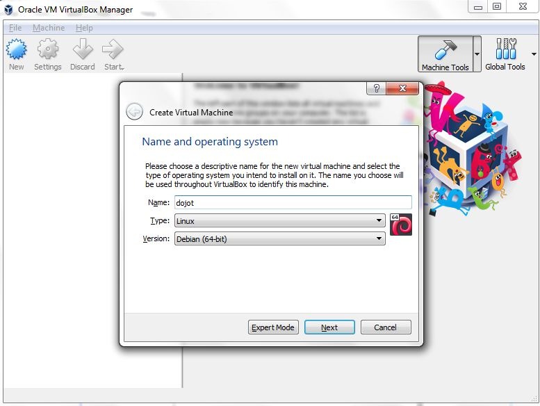
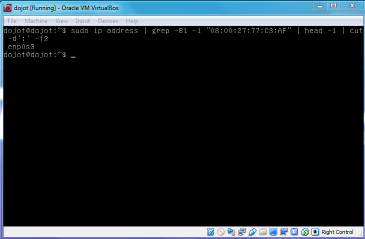

Running dojot on VirtualBox
===================================

This guide provides instructions to run dojot platform on VirtualBox.

You should only run dojot this way if you don’t have any familiarity with 
docker and just want to learn how to use dojot. We don’t recommend it for 
development and much less for experimental or real deployments.

The steps described here were checked on Windows 7, but you shouldn’t have 
problems to run them in different operational systems.

First of all, if you don’t have VirtualBox you’ll need to install it. 
Up to date information and installation procedures can be found at the 
project’s documentation: 

https://www.virtualbox.org/

Then, you need to download a virtual machine image with dojot, which is available at: 

http://dojot-iso.s3.amazonaws.com/imagem/dojot.0.1.0-dojot.vdi

The next step is to create a virtual machine on VirtualBox. Chick on the New button, 
then set the name ``as you wish``, type to ``Linux`` and version to ``Debian (64-bit)``.

Click on Next, and set the memory size. We recommend at least 2048 MB.

Click on Next, and set the hard disk to use an existing virtual hard disk file and choose 
the downloaded image.

Click on Create.

Next, click on Settings/Network and check whether the network adapter is enabled and set it to 
``Host-only``. This will allow host and guest to communicate to each other. 
Write down the MAC Address, you will need it later.

Click on OK and start the virtual machine.
 
Login in the virtual machine (login/password are ``dojot/dojot``) to set the network interface. 
Firstly, get the interface name:

.. code-block:: bash

	$ sudo ip address | grep -B1 -i "<YOUR MAC ADDRESS>" | head -1 | cut -d':' -f2

Edit the file ``/etc/network/interfaces``, adding ::

	# The primary network interface
	auto <YOUR INTERFACE NAME>
	allow-hotplug <YOUR INTERFACE NAME>
	iface <YOUR INTERFACE NAME> inet dhcp

Restart the networking service:

.. code-block:: bash

	$ systemctl restart networking.service

Get the ip address assigned to the interface: 

.. code-block:: bash

	ip address show dev <YOUR INTERFACE NAME>

In the host machine, open a browser and type ``<YOUR IP ADDRESS>:8000``.

